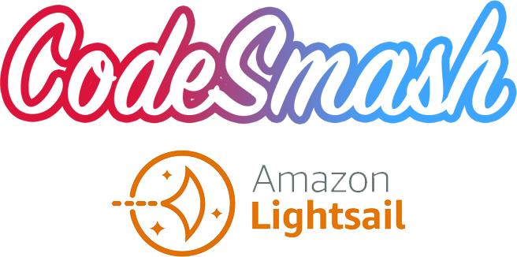

# CodeSmash AWS Lightsail VPS

This repository will be used as a template for deploying AWS Lightsail VPS instance with CodeSmash.
You can the host standalone apps or containers on your instance.
The VPS definition will be stored as code directly in your repository.

 
# How to Deploy the AWS Lightsail VPS instance

You can deploy the AWS Lightsail VPS instance with CodeSmash [here](https://codesmash.studio/deploy).
 
# Module

- ID: codesmash-aws-vps-lightsail
- NAME: CodeSmash AWS Lightsail Terraform Module

## Resources Deployed

Deploys an AWS Lightsail VPS instance on AWS with the following resources:

- API Lightsail
- Static IP address
- Load Balancer
- CDN Distribution

## Operating Systems

- Linux
- Windows
